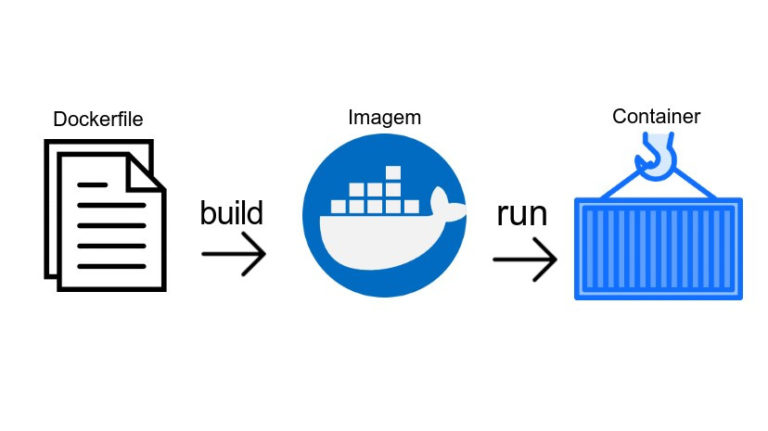

<h1 align="center">Projeto Docker - To Do List</h1>

 
  

  

<!-- TABLE OF CONTENTS -->
<h2 id="table-of-contents"> :book: Tabela de Conteúdos</h2>

  
Tabela de conteúdos

  <ol>
    <li><a href="#sobre"> ➤ Sobre o projeto</a></li>
    <li><a href="#tecnologias"> ➤ Tecnologias utilizadas</a></li>
    <li><a href="#descrição-do-projeto"> ➤ Descrição do projeto</a></li>
    <li><a href="#instruções"> ➤ Instruções</a></li>
    <li><a href="#requisitos"> ➤ Requisitos realizados </a></li>
    <li><a href="#requisito1"> ➤ Requisito 1: Criando um containter </a></li>
    <li><a href="#requisito2"> ➤ Requisito 2: Iniciando um containter </a></li>
    <li><a href="#requisito3"> ➤ Requisito 3: Listando containters </a></li>
    <li><a href="#requisito4"> ➤ Requisito 4: Executando comando sem acoplar </a></li>
    <li><a href="#requisito5"> ➤ Requisito 5: Removendo um containter </a></li>
    <li><a href="#requisito6"> ➤ Requisito 6: Fazendo o download de uma imagem </a></li>
    <li><a href="#requisito7"> ➤ Requisito 7: Manipulando um containter </a></li>
    <li><a href="#requisito8"> ➤ Requisito 8: Parando um containter </a></li>
    <li><a href="#requisito9"> ➤ Requisito 9: Gerando uma build para backend </a></li>
    <li><a href="#requisito10"> ➤ Requisito 10: Gerando uma build para frontend </a></li>
    <li><a href="#requisito11"> ➤ Requisito 11: Gerando uma build para testes </a></li>
    <li><a href="#requisito12"> ➤ Requisito 12: Orquestrando containeres </a></li>
    <li><a href="#créditos"> ➤ Créditos </a></li>
  </ol>

  

<h2 id="sobre"> :pencil: Sobre o projeto </h2>

  
Projeto desenvolvido durante a formação de BackEnd na Trybe com o intuito de consolidar o aprendizado de Docker.

  

    
  

  

<h2 id="tecnologias"> :computer: Tecnologias utilizadas</h2>

  

<h2 id="descrição-do-projeto"> :page_facing_up: Descrição</h2>

  
Descrição
 
  
  Neste projeto eu realizei:
  
  <ol>
    <li>Conteinerização das aplicações;</li>
    <li>Criação de uma conexão entre elas;</li>
    <li>Orquestramento do seu funcionamento.</li>
  </ol> 

  Tem-se uma aplicação full-stack neste repositório: um **app de tarefas**! 
  Esta aplicação foi conteinerizada para funcionar. 
  Foram desenvolvidos os arquivos de configuração para cada frente específica: `Front-end`, `Back-end` e, `teste` que valida se as aplicações estão se comunicando. 

  Foram criadas as imagens para as aplicações e, as mesmas foram configuradas com o `docker-compose`. 

  Para isto, utilizei uma série de comandos do `docker` com diferentes níveis de complexidade.
  Cada comando foi escrito em seu próprio arquivo.

  

<h2 id="instruções"> :scroll: Instruções</h2>

1. Clone o repositório
  * `git clone git@github.com:Gabrielle-Murat/Docker-ToDoList.git`
  * Entre na pasta do repositório que você acabou de clonar;
 

2. Instale as dependências:
  * `npm install`

  

<h2 id="requisitos"> :woman_technologist: Requisitos Realizados:</h2>

  
Comandos Docker:

  <h4 id="requisito1">Requisito 1: Criando um container</h4>
  
    1. Criar um container em modo interativo, sem rodá-lo, nomeando-o como `01container` e utilizando a imagem `alpine` na versão `3.12`

  <h4 id="requisito2">Requisito 2: Iniciando um containter</h4>
  
    2. Iniciar o container `01container`

  <h4 id="requisito3">Requisito 3: Listando containters</h4>
  
    3. Listar os containers filtrando pelo nome `01container`

  <h4 id="requisito4">Requisito 4: Executando comando sem acoplar</h4>
  
    4. Executar o comando `cat /etc/os-release` no container `01container` sem se acoplar a ele

  <h4 id="requisito5">Requisito 5: Removendo um containter</h4>
  
    5. Remover o container `01container`

  <h4 id="requisito6">Requisito 6: Fazendo o download de uma imagem</h4>
  
    6. Fazer o download da imagem `nginx` com a versão `1.21.3-alpine` sem criar ou rodar um container

  <h4 id="requisito7">Requisito 7: Manipulando um containter</h4>
  
    7. Rodar um novo container com a imagem  `nginx` com a versão `1.21.3-alpine` em segundo plano nomeando-o como `02images` e mapeando sua porta padrão de acesso para porta `3000` do sistema hospedeiro

  <h4 id="requisito8">Requisito 8: Parando um containter</h4>
  
    8. Parar o container `02images` que está em andamento

 

  
Dockerfile:

  <h4 id="requisito9">Requisito 9: Gerando uma build para backend</h4>
  
    9. Gerar uma build a partir do Dockerfile do `back-end` do `todo-app` nomeando a imagem para `todobackend`

  <h4 id="requisito10">Requisito 10: Gerando uma build para frontend</h4>
  
    10. Gerar uma build a partir do Dockerfile do `front-end` do `todo-app` nomeando a imagem para `todofrontend`

  <h4 id="requisito11">Requisito 11: Gerando uma build para testes</h4>
  
    11. Gerar uma build a partir do Dockerfile dos `tests` do `todo-app` nomeando a imagem para `todotests`

 

  
Docker-compose:

  <h4 id="requisito12">Requisito 12: Orquestrando containeres</h4>
  
    12. Subir uma orquestração em segundo plano com o docker-compose de forma que `backend`, `frontend` e `tests` consigam se comunicar

 

  

<h2 id="créditos"> 💳 Créditos</h2>

Aplicativo ToDoList (todo-app) fornecido pela Trybe.

