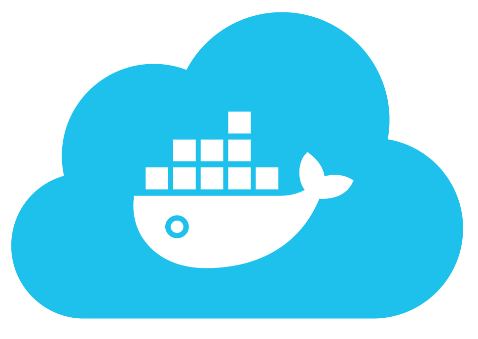

<h1 align="center">Projeto Docker - To Do List</h1>

 
  

<!-- TABLE OF CONTENTS -->
<h2 id="table-of-contents"> :book: Tabela de Conteúdos</h2>

  
Table of Contents

  <ol>
    <li><a href="#sobre"> ➤ Sobre o projeto</a></li>
    <li><a href="#tecnologias"> ➤ Tecnologias utilizadas</a></li>
    <li><a href="#descrição-do-projeto"> ➤ Descrição do projeto</a></li>
    <li><a href="#instruções"> ➤ Instruções</a></li>
    <li><a href="#requisitos"> ➤ Requisitos </a></li>
    <li><a href="#scenario2"> ➤ Scenario 2: Breadth First Search </a></li>
    <li><a href="#scenario3"> ➤ Scenario 3: Uniform Cost Search </a></li>
    <li><a href="#scenario4"> ➤ Scenario 4: A* search algorithm </a></li>
    <li><a href="#scenario5"> ➤ Scenario 5: Finding All Corners </a></li>
    <li><a href="#scenario6"> ➤ Scenario 6: Admissible and Consistent Heuristic </a></li>
    <li><a href="#scenario7"> ➤ Scenario 7: Eating All Dots </a></li>
    <li><a href="#scenario8"> ➤ Scenario 8: Suboptimal Search </a></li>
    <li><a href="#references"> ➤ References</a></li>
    <li><a href="#credits"> ➤ Credits</a></li>
  </ol>

<h2 id="sobre"> :pencil: Sobre o projeto </h2>

 
  Projeto desenvolvido durante a formação de BackEnd na Trybe com o intuito de consolidar o aprendizado de Docker.

<h2 id="tecnologias"> :computer: Tecnologias utilizadas</h2>

Docker

Visual Studio Code

GitHub

<h2 id="descrição-do-projeto">Descrição</h2>

Neste projeto eu realizei:

<ol>
  <li>1. Conteinerização das aplicações;</li>
  <li>2. Criação de uma conexão entre elas;</li>
  <li>3. Orquestramento do seu funcionamento.</li>
</ol>  

Tem-se uma aplicação full-stack neste repositório: um **app de tarefas**! 
Esta aplicação foi conteinerizada para funcionar. 
Foram desenvolvidos os arquivos de configuração para cada frente específica: `Front-end`, `Back-end` e, `teste` que valida se as aplicações estão se comunicando.  

Foram criadas as imagens para as aplicações e, as mesmas foram configuradas com o `docker-compose`.  

Para isto, utilizei uma série de comandos do `docker` com diferentes níveis de complexidade.
Cada comando foi escrito em seu próprio arquivo.

<h2 id="instruções">Instruções</h2>

1. Clone o repositório
* `git clone git@github.com:Gabrielle-Murat/Docker-ToDoList.git`
* Entre na pasta do repositório que você acabou de clonar;

2. Instale as dependências:
  * `npm install`

<h2>Requisitos:</h2>

## Comandos Docker:

### 1. Criar um container em modo interativo, sem rodá-lo, nomeando-o como `01container` e utilizando a imagem `alpine` na versão `3.12`

### 2. Iniciar o container `01container`

### 3. Listar os containers filtrando pelo nome `01container`

### 4. Executar o comando `cat /etc/os-release` no container `01container` sem se acoplar a ele

### 5. Remover o container `01container`

### 6. Fazer o download da imagem `nginx` com a versão `1.21.3-alpine` sem criar ou rodar um container

### 7. Rodar um novo container com a imagem  `nginx` com a versão `1.21.3-alpine` em segundo plano nomeando-o como `02images` e mapeando sua porta padrão de acesso para porta `3000` do sistema hospedeiro

### 8. Parar o container `02images` que está em andamento

## Dockerfile:

### 9. Gerar uma build a partir do Dockerfile do `back-end` do `todo-app` nomeando a imagem para `todobackend`

### 10. Gerar uma build a partir do Dockerfile do `front-end` do `todo-app` nomeando a imagem para `todofrontend`

### 11. Gerar uma build a partir do Dockerfile dos `tests` do `todo-app` nomeando a imagem para `todotests`

## Docker-compose:

### 12. Subir uma orquestração em segundo plano com o docker-compose de forma que `backend`, `frontend` e `tests` consigam se comunicar

